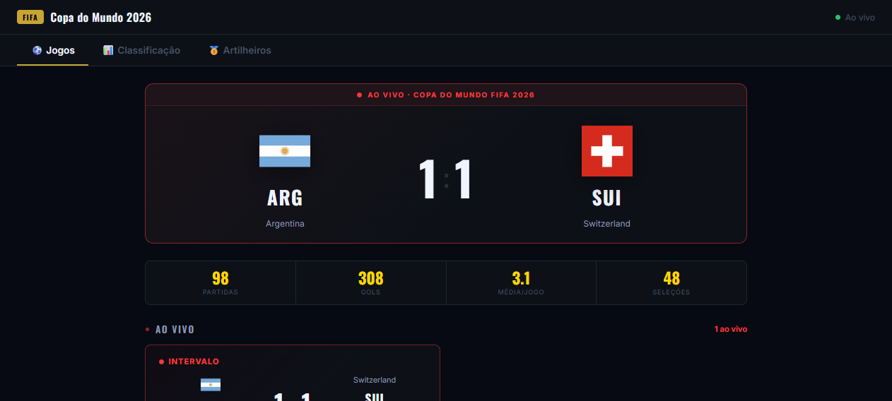
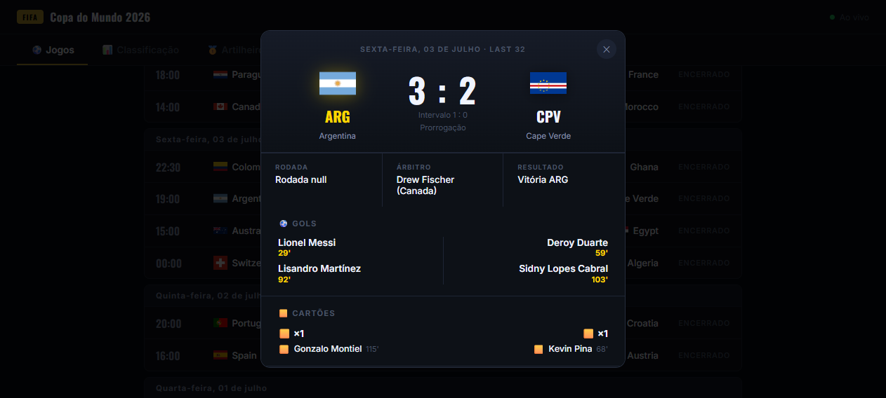
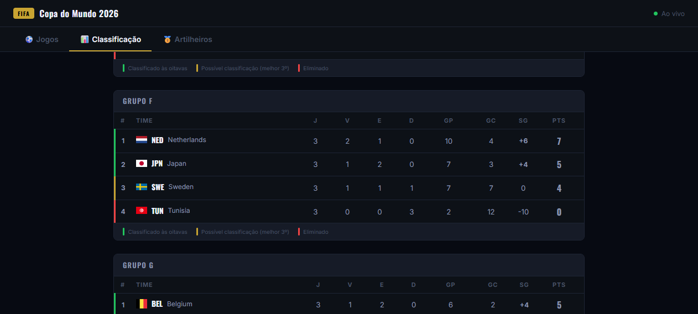

# Copa do Mundo 2026 — Tempo Real ⚽

Placar em tempo real da Copa do Mundo 2026 com eventos ao vivo, classificação por grupos e artilheiros.

🔗 **[Ver ao vivo](https://copa-realtime.vercel.app)**

---

## Preview



<p align="center">
  
  
</p>

<p align="center">
  
</p>

---

## Funcionalidades

- **Placar ao vivo** — jogos em andamento com minuto atual e notificação de gol
- **Modal de detalhes** — gols (jogador + minuto), cartões e substituições ao clicar em qualquer partida
- **Classificação** — todos os grupos com destaque para os classificados
- **Artilheiros** — top 20 goleadores do torneio
- **Hero card** — destaque para o jogo ao vivo ou o próximo a iniciar com countdown
- **WebSocket** — atualizações em tempo real sem precisar recarregar a página
- **Responsivo** — funciona bem em desktop e celular

## Stack

| Camada | Tecnologia |
|--------|-----------|
| Frontend | HTML + CSS + JavaScript (vanilla) |
| API REST | Node.js + Express |
| WebSocket | Socket.io |
| Worker | Node.js (polling de dados) |
| Deploy frontend | Vercel |
| Deploy backend | Railway |
| Dados | football-data.org + ESPN API |

## Arquitetura

```
┌─────────────┐     REST/WS      ┌──────────────┐
│   Frontend  │ ◄──────────────► │  API + WS    │
│   (Vercel)  │                  │  (Railway)   │
└─────────────┘                  └──────┬───────┘
                                        │
                                  ┌─────▼──────┐
                                  │   Worker   │
                                  │  (polling) │
                                  └─────┬──────┘
                                        │
                              ┌─────────▼──────────┐
                              │  football-data.org  │
                              │     ESPN API        │
                              └─────────────────────┘
```

## Como rodar localmente

```bash
# Instalar dependências
cd api && npm install
cd ../ws-server && npm install
cd ../worker && npm install

# Variáveis de ambiente (criar .env na raiz de /api)
FOOTBALL_API_KEY=sua_chave
COMPETITION_ID=2000

# Iniciar
cd api      && npm start   # porta 3000
cd ws-server && npm start  # porta 3001
cd worker    && npm start
```

Abra `frontend/index.html` no navegador ou sirva com qualquer servidor estático.
